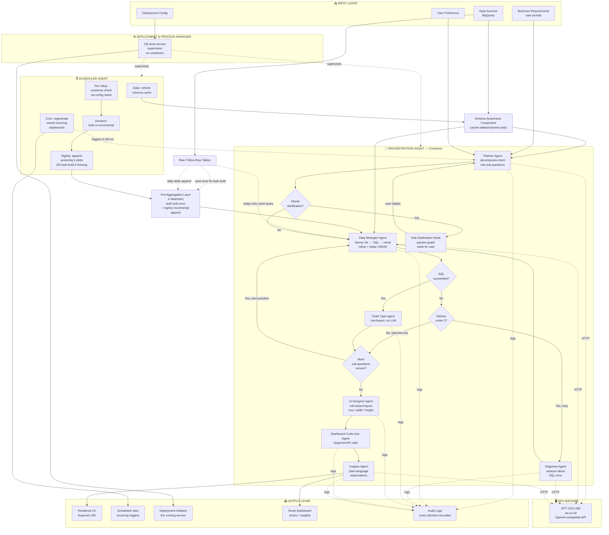

# Bixby Dashboard AI

Natural language → live Superset dashboards for Samsung Bixby production data on BigQuery.

A user types a request (vague like *"how are KPIs doing"* or specific like *"first chart should be total conversations, then show trends"*), and the system reasons through it, queries pre-aggregated BigQuery datamarts (unioned with today's live data when needed), decides chart types, lays them out, and publishes a finished Superset dashboard — all without manual chart configuration.

---

## Scale Reality

Bixby production data is at the scale of **trillions of rows**. Every architectural choice in this system is dictated by that fact.

A naive "let the AI write fresh SQL against the raw table every time" approach would scan tens of terabytes per question, cost a non-trivial amount in BigQuery on-demand charges per dashboard, and take long enough that the dashboard generation would feel broken to the user.

For this reason, **pre-aggregation with incremental refresh is the foundation the rest of the design sits on.** The system maintains compact rollup tables (datamarts) that are:

- **Bulk-built once**, scanning the full raw table — a slow, expensive, one-time operation. Must cover **full available history**, not just a recent slice, otherwise long-range questions silently undercount.
- **Incrementally appended every night** thereafter — yesterday's completed day is processed and one row per grain group is added, with no re-scanning of historical data.
- **Unioned with a tiny "today-only" query** at user-request time, so the dashboard always reflects intraday data even though today isn't yet in the rollup.

Trend or aggregate questions therefore scan only the rollup (a few rows per day) plus, when applicable, today's partial day — never the trillion-row history.

---

## Single-Database-Now, Multi-Database-Ready

The current deployment connects to **one BigQuery database**, but the team has flagged that this may change in the future. The system is built so swapping databases is a configuration + retraining change, never a code change:

- All database connection details live in one config module.
- The Schema Awareness Component re-introspects whichever database the config points at.
- Vanna's training script reads the schema dynamically — pointing it at a different database and re-running training is sufficient.
- All agents operate generically against whatever schema is currently loaded — none of them contain Bixby-specific or database-specific logic in code.

---

## What the System Does

- **Accepts any prompt** — fully vague, fully specific, or mixed (some charts pinned by the user, others left to the AI).
- **Decomposes** vague requests into multiple chart-worthy sub-questions using Chain of Thought reasoning.
- **Routes each sub-question to a rollup datamart whenever possible**, unioning with today's raw data only as needed for fresh-data accuracy.
- **Generates BigQuery SQL** via Vanna AI (open-source MIT framework) running on the CPU server, using a locally-hosted GPT OSS 20B model on a separate GPU machine for language generation.
- **Self-heals SQL errors** — diagnoses what likely went wrong and retries up to 3 times before skipping that chart.
- **Pauses to ask** when a prompt is too ambiguous to default safely.
- **Picks chart types using deterministic rules** based on the shape of the SQL result.
- **Auto-lays out** charts on Superset's 12-column grid.
- **Schedules** recurring dashboards, daily schema refresh, and the nightly rollup append.
- **Returns a Superset dashboard URL** the user opens in their browser.

---

## Datamart Catalog

The system maintains a fixed set of pre-aggregated rollup tables (Option 1 — per-question-type datamarts). Each datamart corresponds to one of the question purposes the Planner Agent generates (headline, trend, breakdown, comparison).

**Naming convention (strictly enforced):** `<grain>_<subject>_summary` — e.g. `daily_kpi_summary`, never `kpi_summary_daily` or `kpi_daily_summary`. Every reference to a rollup name comes from one config variable per rollup, never a string literal in code. See LLD section 4.9 for the discipline.

**Additive-counts principle:** each row stores raw counts and sums, never pre-computed rates. Rates are computed at query time after summing the relevant rows. This is the only way multi-day aggregations come out mathematically correct.

| Datamart | Grain | Columns | Answers Questions Like |
|---|---|---|---|
| `daily_kpi_summary` | one row per (day, execution_result) | day, execution_result, total_conversations, sum_kpi_completion | "trend of success rate over weeks", "average KPI by day" |
| `daily_device_summary` | one row per (day, device_type) | day, device_type, total_conversations, successful_conversations, sum_kpi_completion | "which devices have lowest success rate", "device trends" |
| `hourly_volume_summary` | one row per hour | hour_timestamp, total_conversations | "conversation volume by hour of day", "busiest hours" |
| `daily_region_summary` | one row per (day, region) | day, region, total_conversations, successful_conversations, sum_kpi_completion | "regional KPI comparison" |

If a future recurring question pattern shows up that none of these four answer well, a fifth datamart is added following the same naming and additive-counts conventions.

---

## Architecture (Agent Diagram)

---

## How the Rollup Refresh Actually Works

This is the part that makes the system feasible at trillion-row scale. The Scheduler Agent handles it with no human intervention.

### One-time Bulk Build
When the rollup table is missing (first deployment, or schema changed), the Scheduler runs the full aggregation SQL once across the entire raw history. This is the slow, expensive step — runs once. Must cover full history, not a recent slice.

### Nightly Incremental Append
Every night, the Scheduler performs an **existence check** on each rollup using the name from config. If the table exists, it scans only yesterday's new rows in the raw table, aggregates them, and appends one row per grain group to the rollup. Historical days are never re-scanned.

### Today's Data (Live Union)
When a user asks a question covering today, the Data Wrangler's SQL has two parts unioned together:
1. Read completed days directly from the rollup.
2. Aggregate today's partial day from the raw table, filtered tightly to `WHERE DATE(local_timestamp) = today`.

**Example: "Last 5 days success rate"**
- 4 rows pulled from rollup (Days N-4 through N-1, already pre-aggregated)
- 1 fresh aggregation of today's partial day from raw
- Union → 5 rows total → chart rendered

---

## Framework Decision Rationale

| Concern | Choice | Why Not Alternatives |
|---|---|---|
| Agent orchestration with branches, retries, pauses | **LangGraph** | CrewAI/AutoGen are for multi-agent debate, not sequential branching. Plain Python would reimplement what LangGraph does well. |
| Scheduling (daily schema, nightly rollup, recurring dashboards) | **APScheduler** in-process | Airflow/Prefect/Dagster need their own database + workers + UI — overkill for this scale. |
| Text-to-SQL | **Vanna AI** (open-source, MIT) | Purpose-built; runs locally; learns from past queries; framework-only, plug any LLM in. |
| Local LLM serving | **vLLM** with GPT OSS 20B | OpenAI-compatible API means Vanna and the agents need no code changes to use it. |
| Web service | **FastAPI** | Lightweight, well-supported, async-capable. |
| Process supervision | **systemd** (Linux) or **Task Scheduler** (Windows) | Built into the OS; no containers needed or permitted. |

---

## Per-Agent Responsibilities (Summary)

For full per-agent contracts and behavior see `LLD.md`. Quick reference:

| Agent | LLM-Driven? | What It Does |
|---|---|---|
| Orchestration Agent | No (logic) | Routes between agents, handles retries, holds shared state |
| Planner Agent | Yes | Decomposes vague prompts into concrete sub-questions |
| Data Wrangler Agent | Yes (via Vanna) | Generates SQL preferring rollup + today-union pattern, executes it |
| Diagnose Agent | Yes | Reads SQL errors, suggests fixes for retry |
| Chart Type Agent | No (rules) | Inspects DataFrame shape, picks viz type |
| UI Designer Agent | No (rules) | Lays out charts on the 12-column grid |
| Dashboard Code Gen Agent | No (HTTP) | Creates virtual datasets, charts, dashboard in Superset |
| Insights Agent | Yes | Writes 2-4 plain-language observations from the data |
| Scheduler Agent | No | Daily schema refresh, nightly rollup append, recurring dashboards |
| Schema Awareness Component | No | Cached daily snapshot of all tables/columns |
| Pre-Aggregation Layer | No (data) | The 4 datamart tables themselves, maintained by Scheduler |
| Deployment & Process Manager | No | OS-level service supervision |

---

## Setup & Operation (Conceptual)

**One-time setup**
- Provision a CPU VM and a separate GPU machine.
- Install Python and dependencies on the VM.
- Place BigQuery service-account credentials on the VM with restricted file permissions.
- Configure the config module: project IDs, URLs, credentials paths, datamart specs (with the single source-of-truth name per rollup).
- Run the one-time training script to teach Vanna the schema and the datamarts.
- Trigger the first bulk build of each datamart.
- Register the API service with the OS supervisor (systemd / Task Scheduler).

**Daily operation**
- Team members send prompts to the API.
- Scheduler runs existence check on each datamart nightly, then appends yesterday's delta automatically.
- Recurring dashboards regenerate automatically per their saved schedules.
- Audit logs rotate daily.

**Troubleshooting**
- Logs are the first stop — every agent's decisions are timestamped.
- If a category of question keeps failing, add example Q→SQL pairs to the training script and re-run.
- If a datamart looks stale, check the Scheduler's last-run log for the existence-check decision and the append SQL.

---

## What's Deliberately Not Included

For 10–50 users on one server with open data access, these would be overkill:

- Container orchestration (Kubernetes, Docker Swarm).
- Container runtime (Docker, Podman) — not permitted in this deployment.
- External workflow orchestrators (Airflow, Prefect, Dagster).
- Multi-agent debating frameworks (CrewAI, AutoGen).
- Distributed task queues (Celery, RabbitMQ, Redis).
- Role-based access control — data is open in this setup.
- A separate audit database — plain text log files are sufficient at this scale.
- Multiple LLMs — one shared local GPT OSS 20B for every agent.

Each would add maintenance burden without adding capability at this team size and access model.
